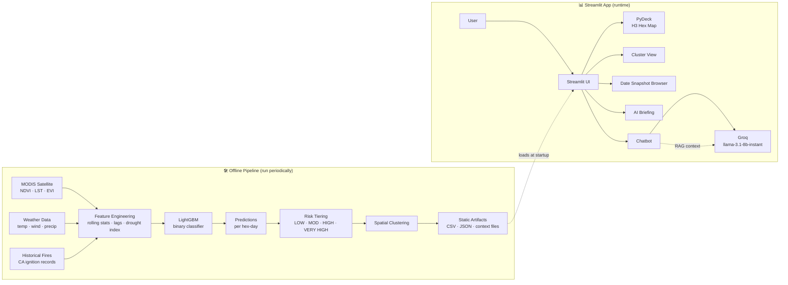

# Architecture

WildfireWatch is split into two halves: an **offline pipeline** that trains the
model and produces static artifacts, and an **interactive Streamlit app** that
serves those artifacts and adds an LLM chatbot on top.

## High-Level Flow

## Offline Pipeline

Producing the artifacts that ship with the repo:

1. **Ingest** — pull MODIS satellite composites, weather records, and historical
   fire ignition data for California, 2020–2025.
2. **Feature engineering** — compute 31 features per hex-day across weather,
   satellite, derived (rolling/lag/drought), temporal, and spatial families.
   See [`methodology.md`](methodology.md) for the full feature list.
3. **Train** — fit a LightGBM binary classifier on ~2.9M hex-day observations.
   Target: did a fire start in this hex within 14 days?
4. **Score** — generate `P(fire within 14 days)` for every hex-day in the
   forecast window, plus the top-3 drivers per prediction.
5. **Tier** — bucket probabilities into LOW / MODERATE / HIGH / VERY HIGH.
6. **Cluster** — group adjacent elevated-risk hexes into named regional clusters
   (e.g., "San Gabriel Mountains", "Shasta-Trinity Region") and emit
   `clusters.json`.
7. **Generate briefings** — produce a natural-language summary per snapshot date
   and emit `briefing.json`.
8. **Build RAG context** — assemble `rag_context.txt` (current cluster stats +
   model reference + CAL FIRE emergency-management knowledge) and
   `chatbot_context.txt` (system prompt) for the Q&A chatbot.

The Streamlit app does **not** retrain or rescore at runtime — it consumes the
artifacts as-is.

## Runtime: Streamlit App

What happens when a user opens the dashboard:

- **Boot** — `app.py` loads `predictions_with_risk.csv`, `ca_hexagons.json`,
  `clusters.json`, `briefing.json`, and the RAG context files into memory.
- **Map layer** — predictions are joined to H3 cell geometries; PyDeck renders a
  hexagon polygon layer over a base map, shaded by risk tier with tooltips
  showing the top drivers.
- **Cluster panel** — `clusters.json` populates a regional callout list with
  per-cluster stats (probability, temperature, wind, NDVI, drought index).
- **Date snapshot browser** — users pick a date from `date_snapshots/`; the app
  re-renders the map and panels for that date.
- **AI briefing** — the precomputed briefing for the active date is shown;
  no LLM call is made for the briefing itself, only for the chatbot.
- **Chatbot** — when the user asks a question, the app sends
  `chatbot_context.txt` (system prompt) + `rag_context.txt` (knowledge) +
  the user's message to Groq's `llama-3.1-8b-instant`. The RAG content
  grounds answers in our model's actual outputs and in CAL FIRE emergency-
  management reference material.

## Why This Split

Precomputing predictions and serving static artifacts has three concrete
benefits for a stakeholder-facing prototype:

1. **Deployable for free.** The runtime has no model server, no GPU, no heavy
   memory footprint — just Streamlit reading CSVs and JSON. It runs on the
   Streamlit Community Cloud free tier.
2. **Reproducible.** Every artifact in the repo is checked in, so a reviewer can
   pull the repo and see exactly what the dashboard saw on a given date,
   without rerunning a 2.9M-row training job.
3. **Decoupled.** The modeling team and the UI team can iterate independently.
   New artifacts drop in without app changes; UI changes don't risk breaking
   the model.

The trade-off is that predictions don't update in real time. For an early-
warning prototype on a 14-day horizon, that's acceptable; for an operational
deployment we'd add a scheduled retraining job and a small API layer.

## Components

| Component | Role |
| --- | --- |
| `app.py` | Streamlit entrypoint — loads artifacts, renders UI, calls Groq |
| `predictions_with_risk.csv` | Per-hex-per-date probability, risk tier, top-3 drivers, raw features |
| `ca_hexagons.json` | H3 res-5 hexagon geometry for California (1,523 cells) |
| `clusters.json` | Regional clusters of elevated-risk hexes with summary stats |
| `briefing.json` | Pre-generated natural-language briefings per snapshot date |
| `date_snapshots/` | Historical predictions browsable by date |
| `chatbot_context.txt` | System prompt for the Q&A chatbot |
| `rag_context.txt` | Retrieval-augmented knowledge: model facts + emergency mgmt reference |
| `requirements.txt` | Runtime dependencies |
| `.streamlit/` | Theme and config |
| `.devcontainer/` | Codespaces / VS Code dev container |
